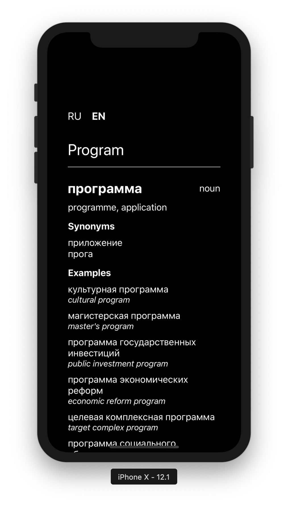
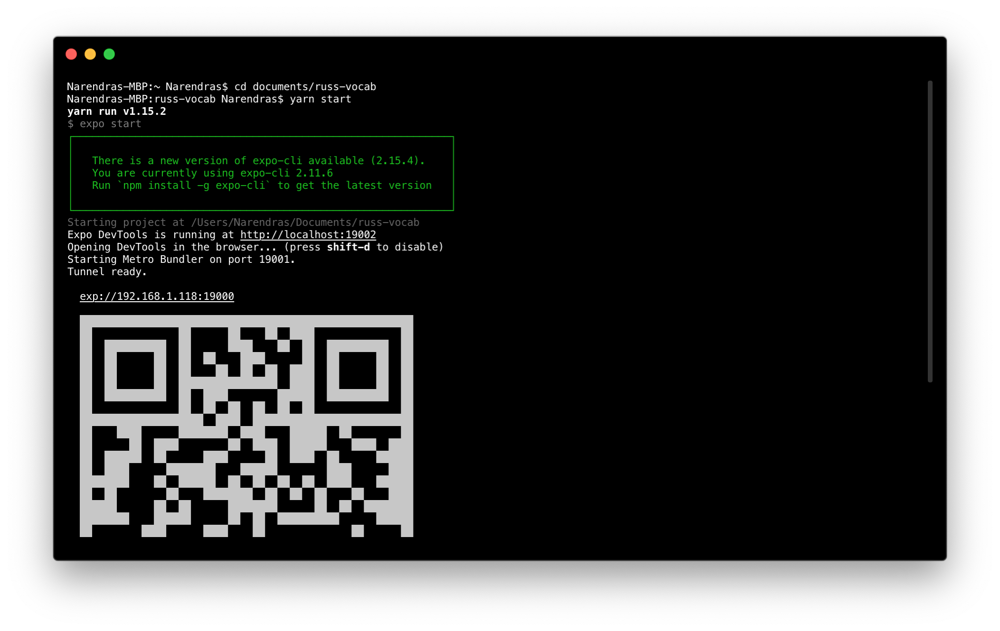

# RussVocab

<p align="center">
  
</p>

React native app for looking up definitions, synonyms, common examples and translations between Russian and English. Uses the Yandex API for the dictionary info.

## Getting Started

### Expo

This project uses the Expo CLI for development. First install it globally:

```
$ npm install -g expo-cli
```

Expo also allows you to run the app on your mobile devices. You have to install the Expo App on your phone then scan the QR code generated by this project to run the app locally. Download the app on the [playstore](https://play.google.com/store/apps/details?id=host.exp.exponent) for android devices or on the [app store](https://itunes.com/apps/exponent) for ios.

To run it on a simulator, you have to download and install the corresponding emulators as described in the [expo docs](https://docs.expo.io/versions/latest/introduction/installation/).

Then clone the repo:

```
$ git clone https://github.com/narendrasss/russ-vocab.git
```

### Yandex

This app uses the Yandex API to fetch the dictionary information. You first need to get an API key from the Yandex website [here](https://tech.yandex.com/dictionary/). After having the key, create a `config.js` file at the root directory and paste the following:

```js
export const url = `https://dictionary.yandex.net/api/v1/dicservice.json/lookup?key=${API_KEY}`;
```

Where `API_KEY` is your Yandex API key.

### Running the App

Then run npm install to install all dependencies:

```
$ cd russ-vocab && npm install
```

Then run `npm start` to launch the dev server. This will generate an output like the following:

<p align="center">
  
</p>

You can scan the QR code to run the app locally, or type `android` or `ios` to run the corresponding simulators.

> Alternatively you can run `npm run ios` or `npm run android` to immediately start the simulators.

## Using the App

First pick whatever language your input would be (RU for russian and EN for english). Type the word and the program would fetch information from the API if it finds one.
